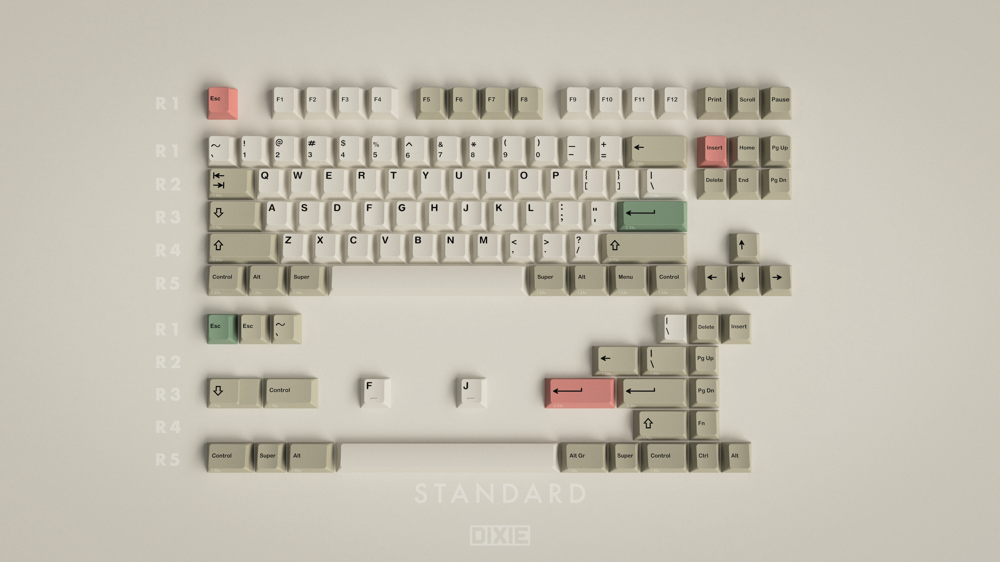
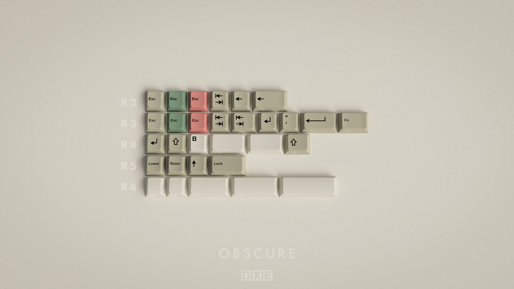
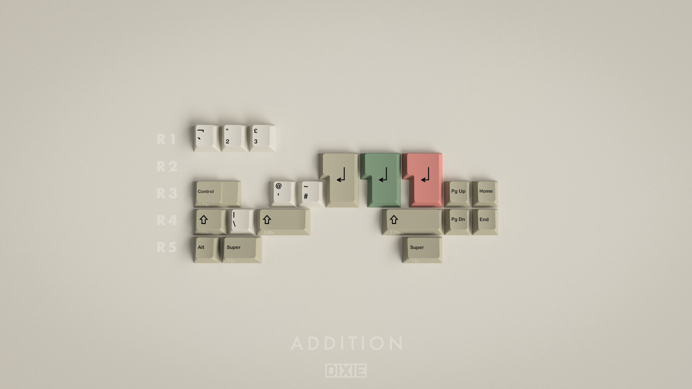
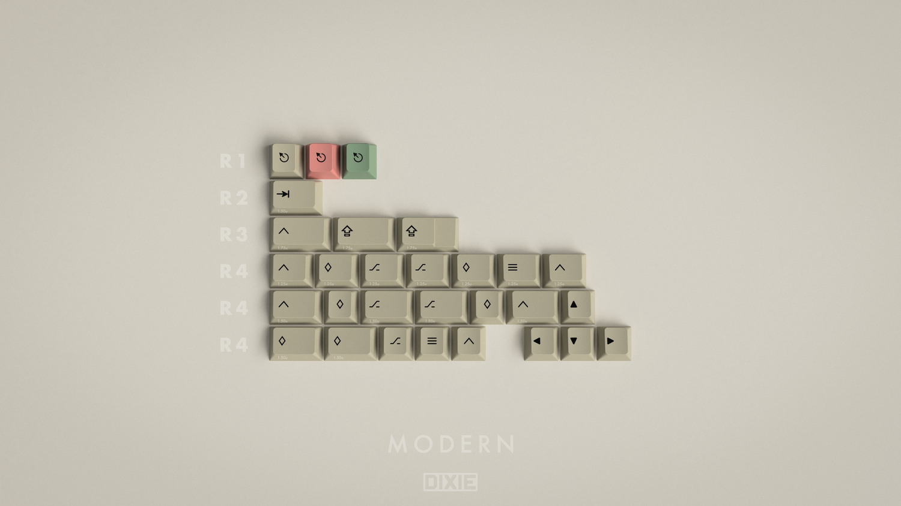
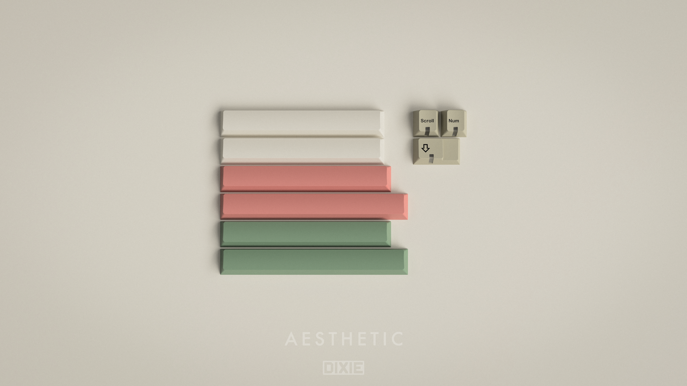
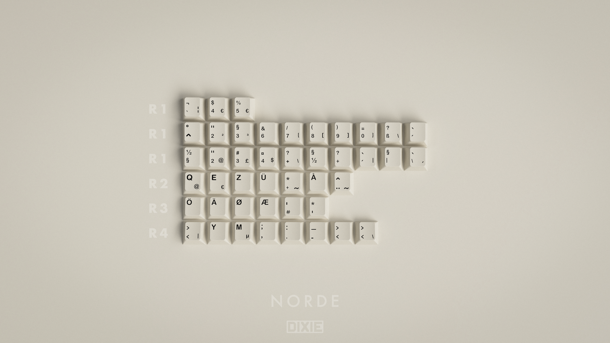
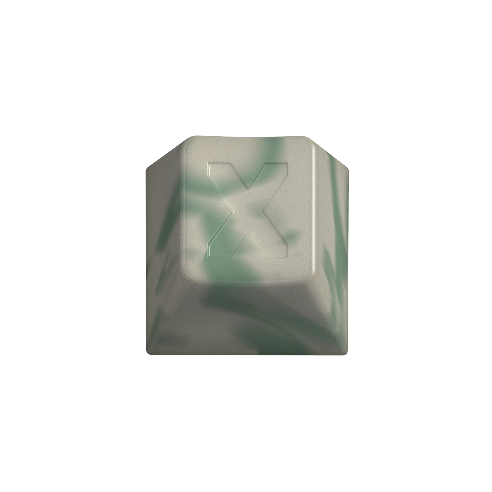
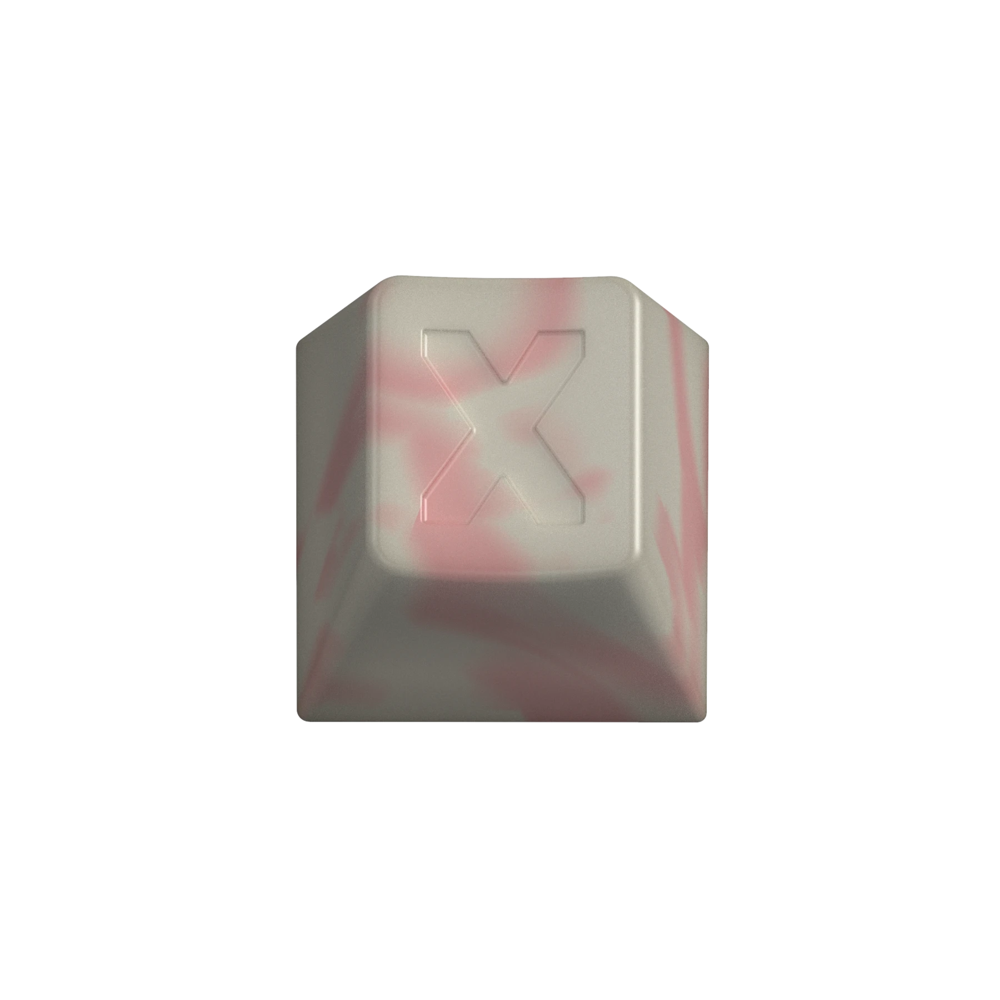

# [GMK 9009 R3](https://geekhack.org/index.php?topic=102259.0)

| Kit               | Have    | Want    | Pictures                                       |
| :-----------------| :------ | :------ | :--------------------------------------------- |
| Standard          |    ✓    |    ✗    |          |
| Obscure           |    ✓    |    ✗    |           |
| Numbers           |    ✓    |    ✗    |           |
| Addition          |    ✓    |    ✗    |          |
| Modern            |    ✗    |    ✗    |            |
| Aesthetic         |    ✓    |    ✗    |         |
| Norde             |    ✗    |    ✗    |             |
| Green RAMA Swirl  |    ✗    |    ✗    |  |
| Red RAMA Swirl    |    ✗    |    ✗    |    |
| Beige RAMA Swirl  |    ✗    |    ✗    |  |
