# [GMK Oblivion V2](https://geekhack.org/index.php?topic=101034.0)

| Kit                        | Have    | Want    | Pictures |
| :------------------------- | :------ | :------ | :------- |
| Git Base Kit               |    ✗    |    ✗    | 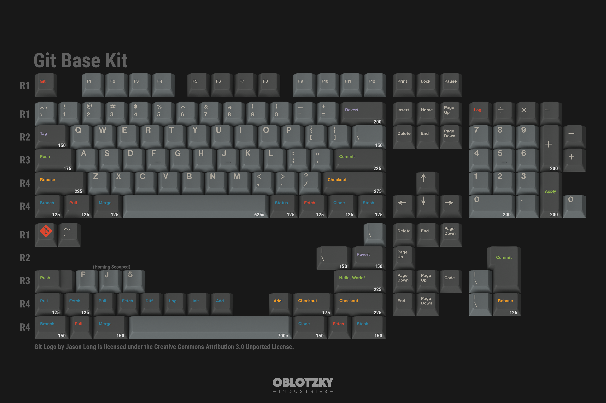 |
| Regular Base Kit           |    ✓    |    ✗    | 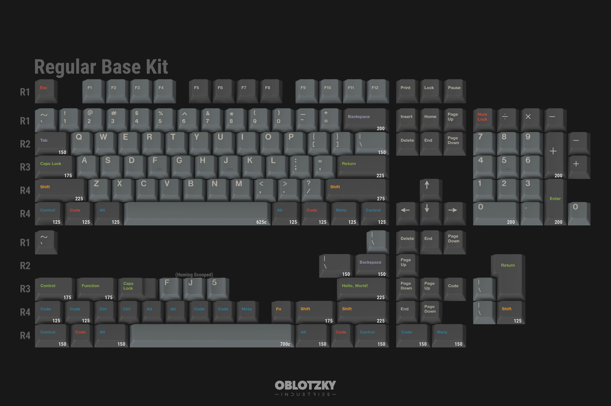 |
| Monochrome Base Kit        |    ✗    |    ✗    | 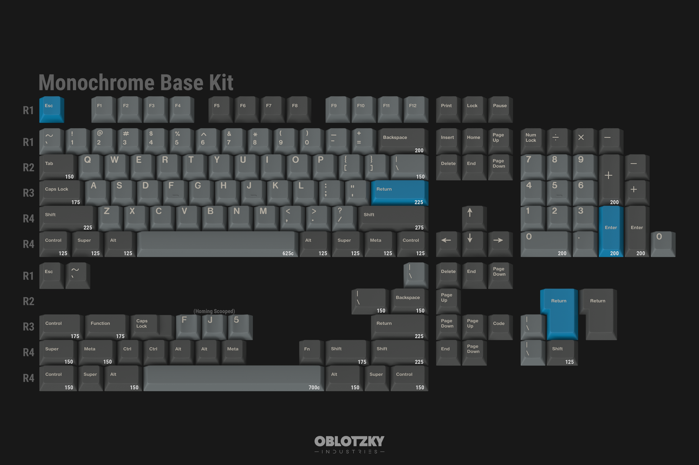 |
| Assembly Base Kit          |    ✗    |    ✗    | 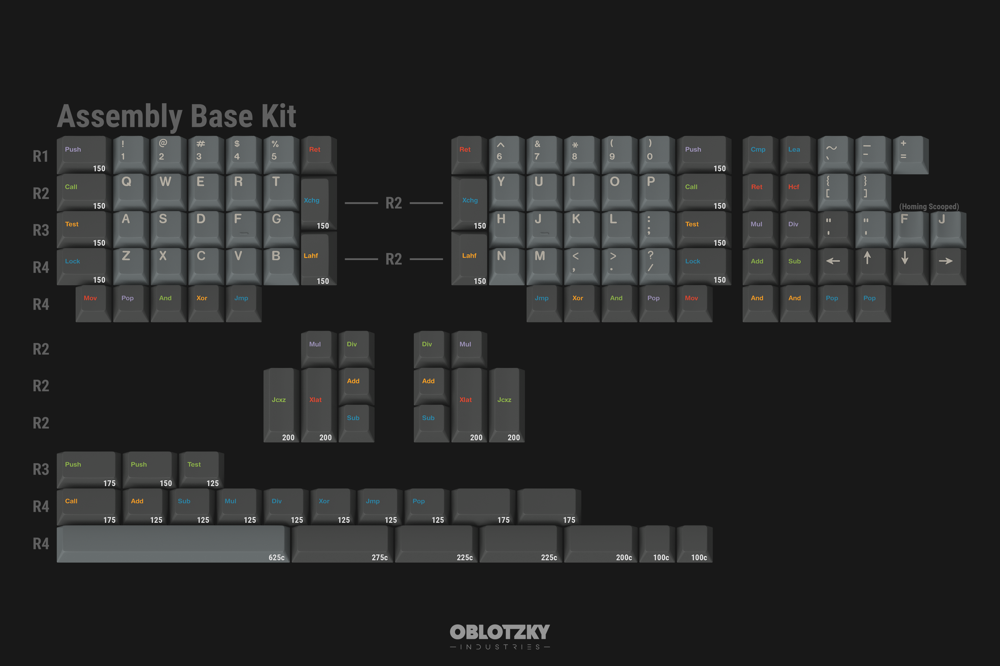 |
| Oblivion Cadet             |    ✗    |    ✓    | 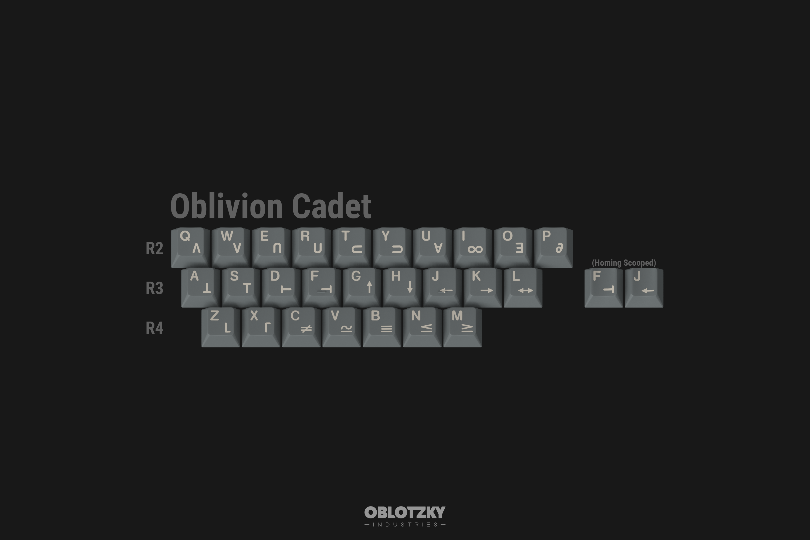 |
| Hagoromo Alphas            |    ✗    |    ✓    |  |
| Hagoromo Cadet Alphas      |    ✗    |    ✓    | 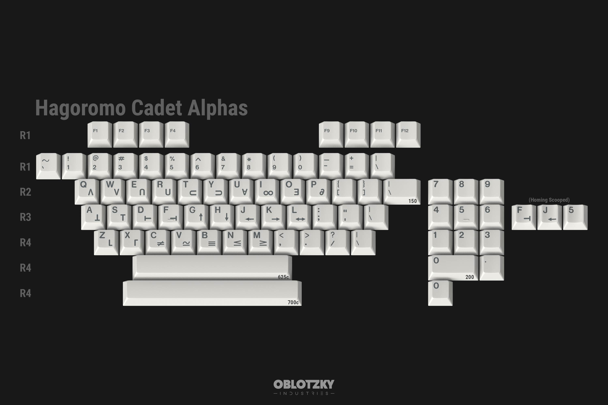 |
| Vim                        |    ✗    |    ✗    | 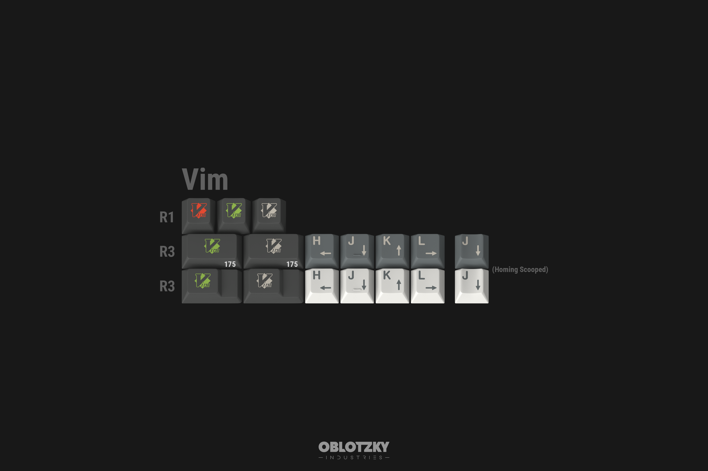 |
| Alternate Function Colors  |    ✗    |    ✓    | 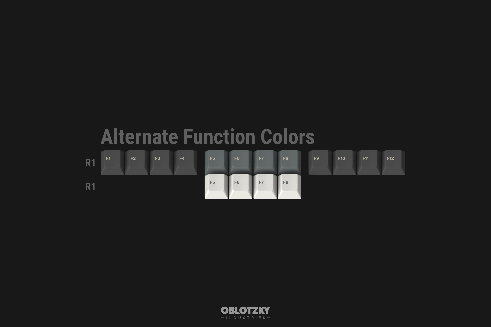 |
| Spacekeys                  |    ✗    |    ✗    | 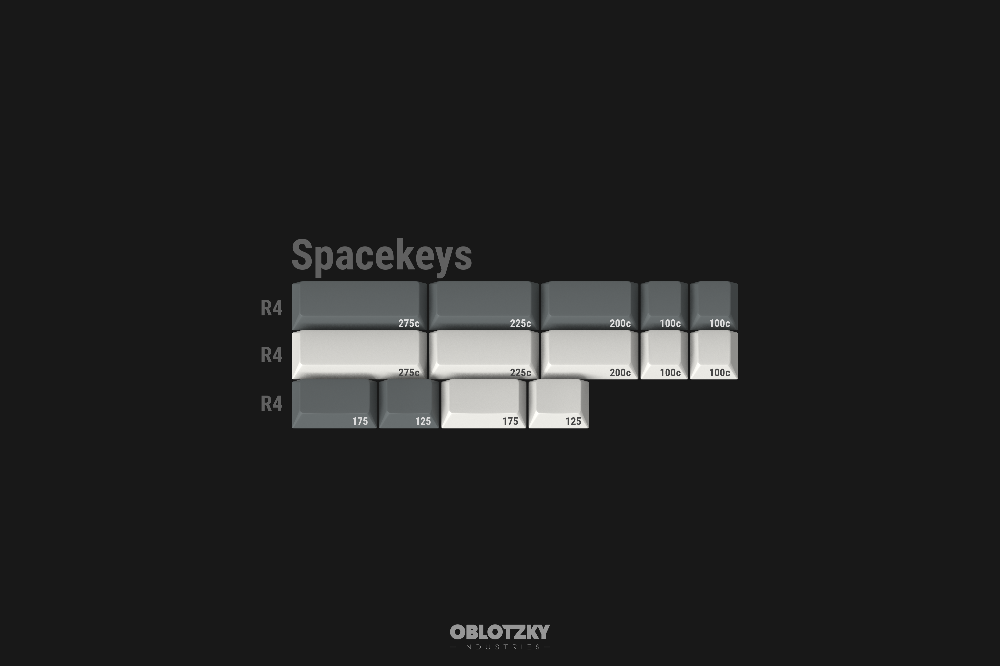 |
| 6u Spacebars               |    ✗    |    ✗    | 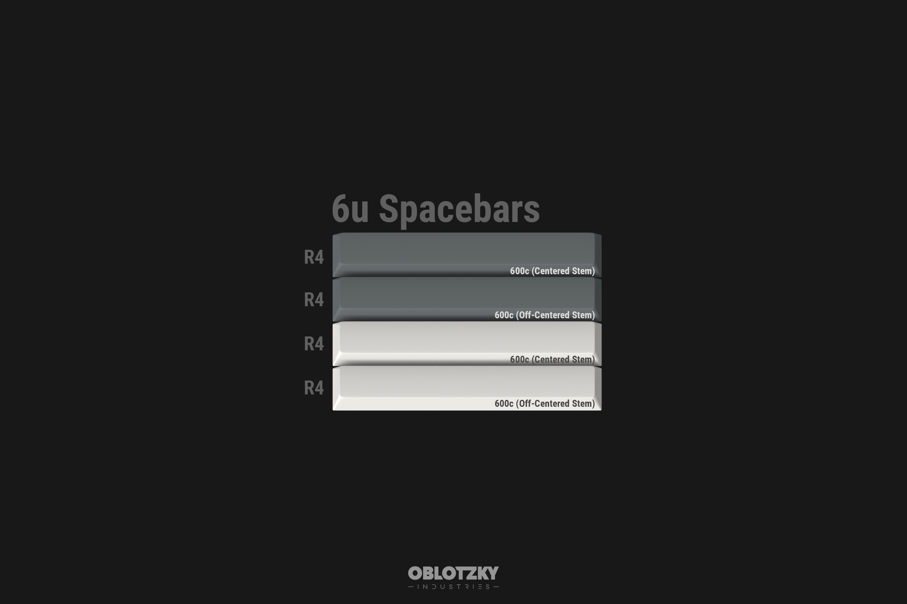 |
| Oblivion Colevrak          |    ✗    |    ✗    | 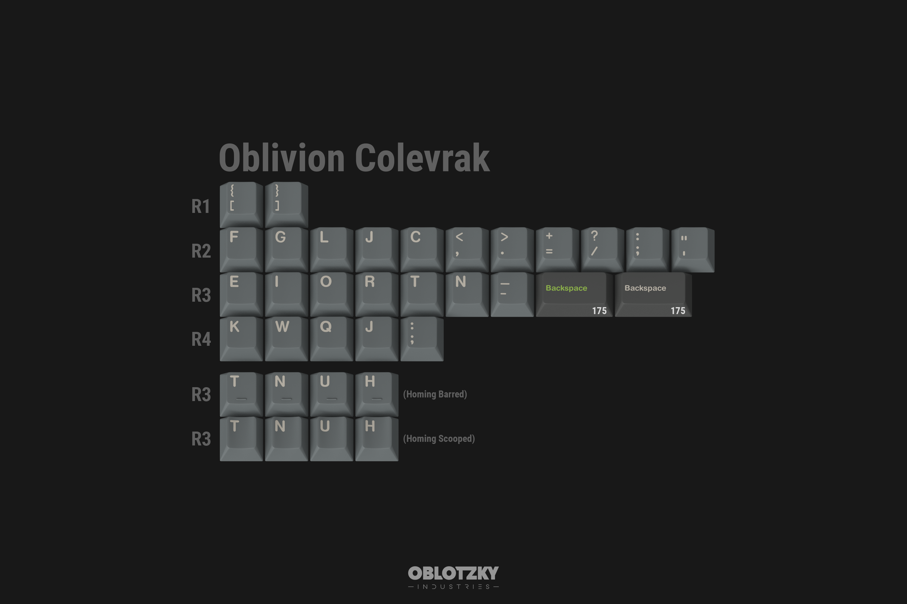 |
| Oblivion International     |    ✗    |    ✗    | 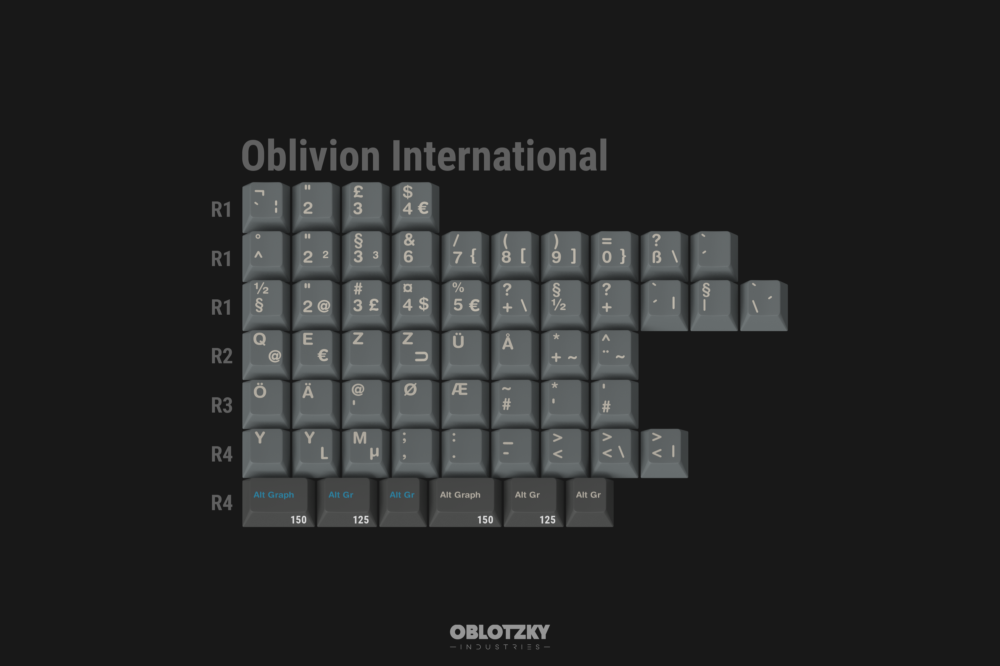 |
