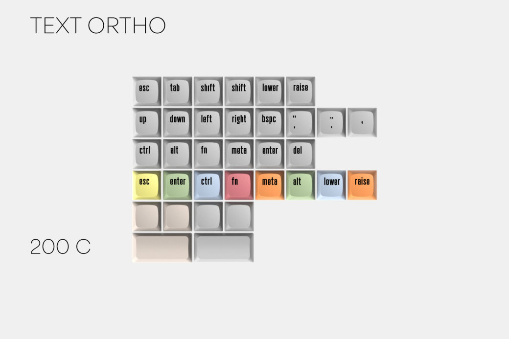

# XDA Canvas (R2)

| Kit                                   | Have    | Want    | Pictures |
| :-------------------------------------| :------ | :------ | :------- |
| Alphas                                |    ✓    |    ✗    |  |
| Betas                                 |    ✗    |    ✗    |  |
| Rams                                  |    ✗    |    ✗    |  |
| Text Mods                             |    ✓    |    ✗    |  |
| Micons Mods                           |    ✗    |    ✗    |  |
| Alphapad                              |    ✓    |    ✗    |  |
| Betapad                               |    ✗    |    ✗    |  |
| Viopad                                |    ✗    |    ✗    |  |
| Wolfgang                              |    ✗    |    ✗    |  |
| Manfred                               |    ✗    |    ✗    |  |
| Text Hobbyist                         |    ✓    |    ✗    |  |
| Micons Hobbyist                       |    ✗    |    ✗    |  |
| Exotic                                |    ✓    |    ✗    |  |
| 40s Text                              |    ✗    |    ✗    |  |
| 40s Micons                            |    ✗    |    ✗    |  |
| Text Ortho                            |    ✗    |    ✗    |  |
| Micons Ortho                          |    ✗    |    ✗    |  |
| Ergo Text                             |    ✗    |    ✗    |  |
| Ergo Micons                           |    ✗    |    ✗    |  |
| UK                                    |    ✗    |    ✗    |  |
| Norde                                 |    ✗    |    ✗    |  |
| Woz                                   |    ✓    |    ✗    |  |
| Gates                                 |    ✗    |    ✗    |  |
| Haus                                  |    ✗    |    ✗    |  |
| Text Bauhaus                          |    ✓    |    ✗    |  |
| Micons Bauhaus                        |    ✗    |    ✗    |  |
| MonoAlphas                            |    ✗    |    ✗    |  |
| MonoBetas                             |    ✗    |    ✗    |  |
| Dieter                                |    ✓    |    ✗    |  |
| Minibars                              |    ✓    |    ✗    |  |
| Oddbars                               |    ✗    |    ✗    |  |
| Spacebars                             |    ✓    |    ✗    |  |
| F-Row                                 |    ✗    |    ✗    |  |
| Arrows                                |    ✓    |    ✗    |  |
| Sym                                   |    ✓    |    ✗    |  |
| Keyluminatti                          |    ✓    |    ✗    |  |
